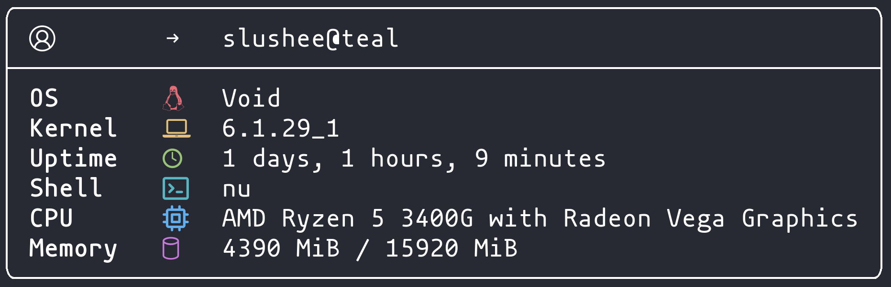

#  Arifetch

**A simple system fetch built with Rust**

*By Aria Fibla and Pol Fernàndez*



## Installation

```
cargo install --git https://github.com/lxbx44/arifetch.git
```

## Usage

```
arifetch
```

## Manual Installation

- Download the files from the [releases](https://github.com/lxbx44/arifetch/releases/) tab or from the `app/` directory.
